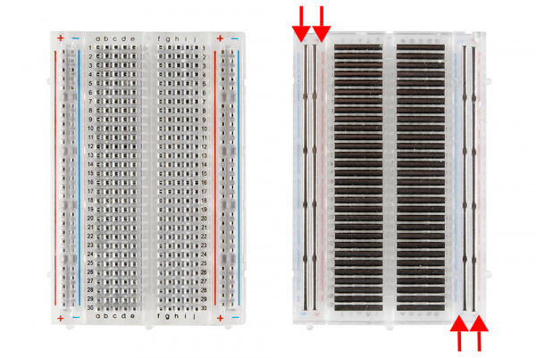
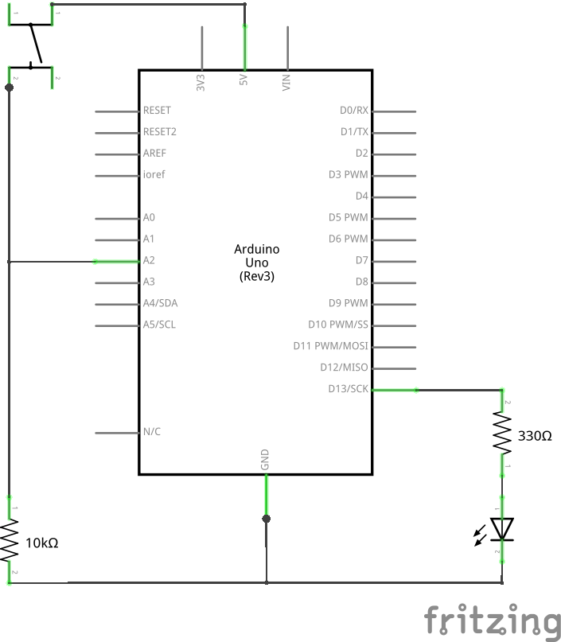
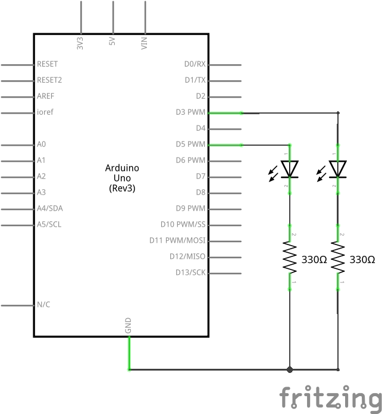
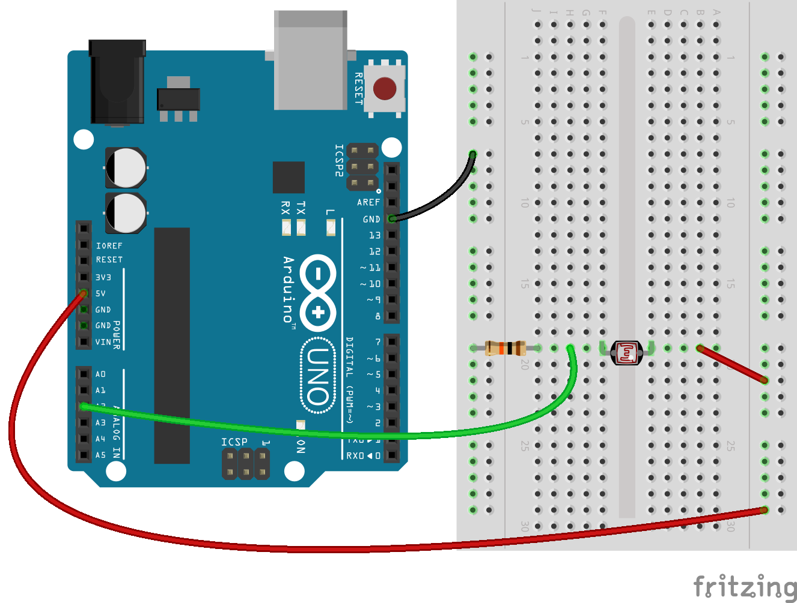
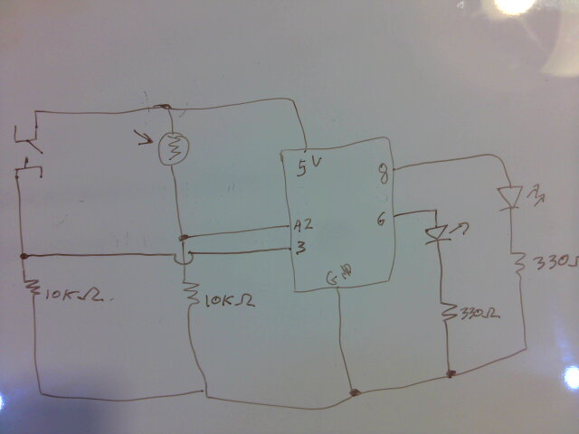
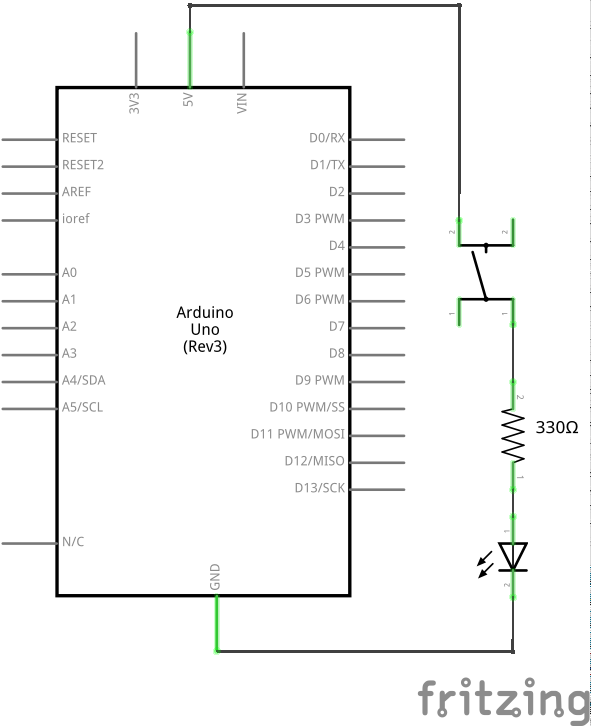
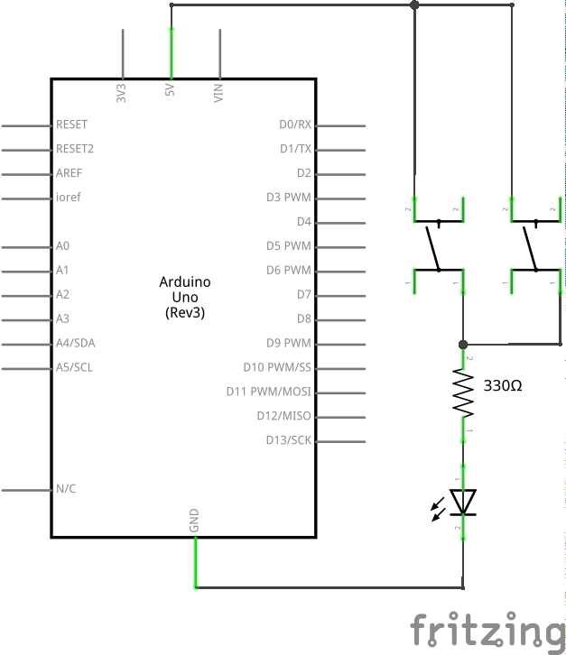
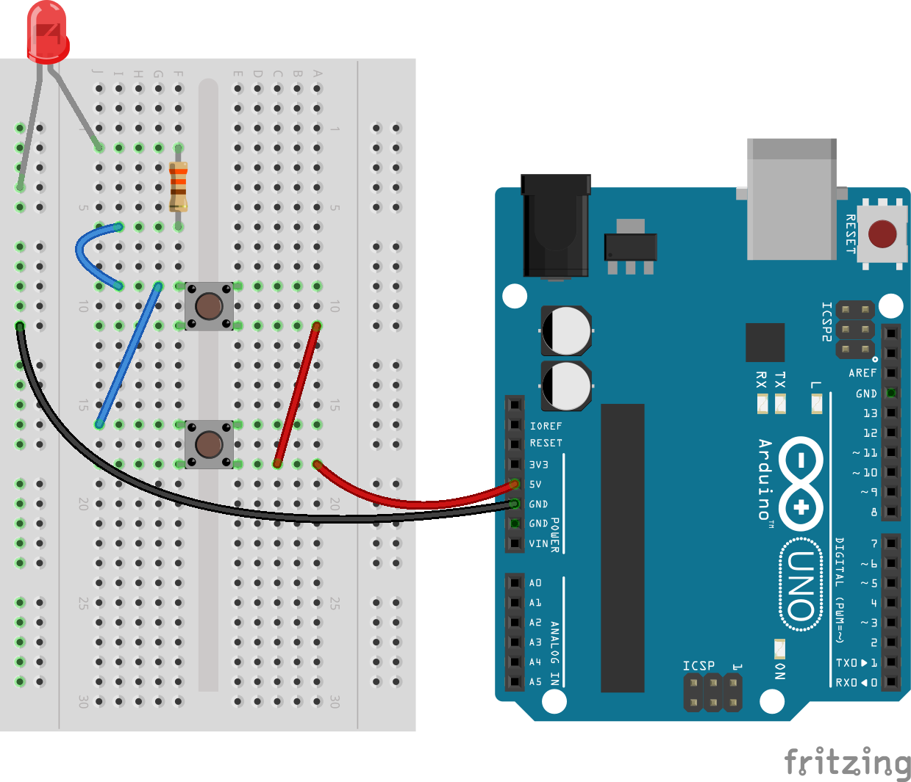
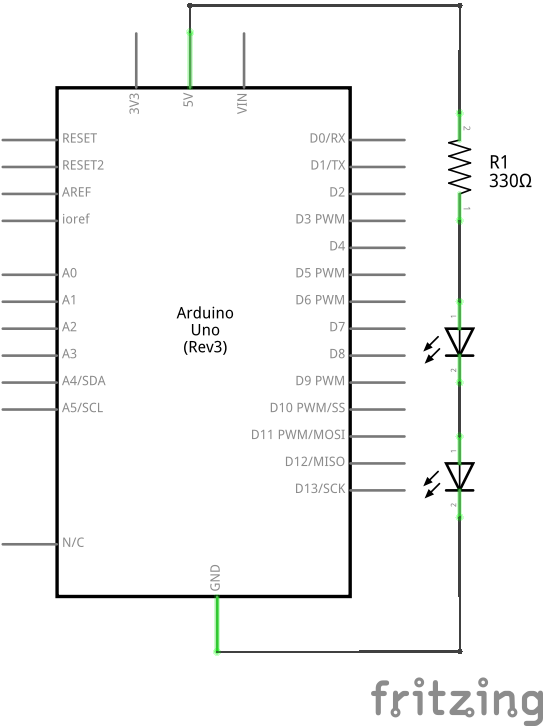
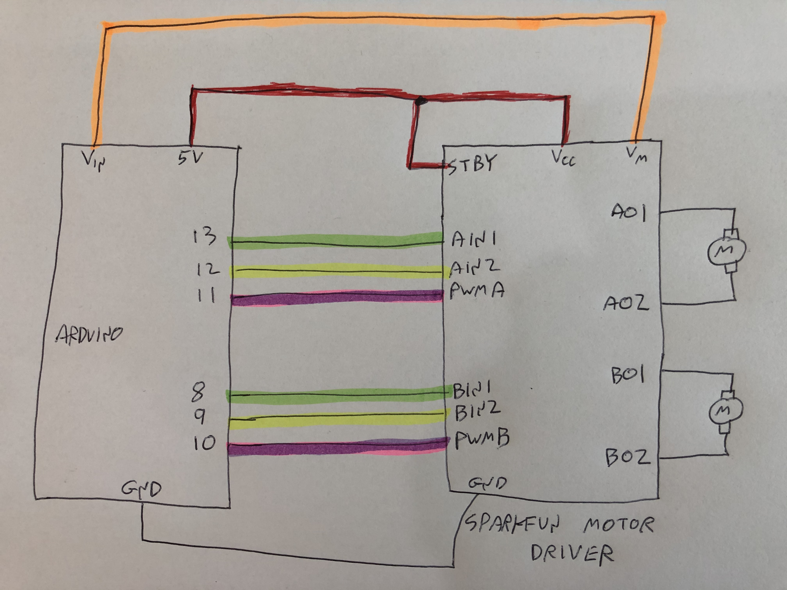

## Welcome to DES INV 23: Creative Programming and Electronics

Shortcut to [Today's lecture](#todays-lecture)

#### Details 

- Session: D
- July 6 - August 14 (six weeks)
- Monday 9am-12:30pm
- Wednesday 9am-1:00pm

- Instructor: Michael Shiloh
- shiloh@berkeley.edu
- Office hours: email me to set up appointment

- GSI: Tina Piracci
- tina_piracci@berkeley.edu
- Office hours: **TBA**

- Course site: https://github.com/michaelshiloh/CreativeProgrammingAndElectronicsBerkeley

### This page: Lecture notes

<h1>This document: Lecture Notes</h1>
This is all subject to change


### 06 July 2020

#### Administration

- **Record Zoom!**
- Download the [Arduino IDE](https://www.arduino.cc/en/Main/Software)
- Download [Processing](https://processing.org/download/)
- Introductions: me, Tina, you
- Syllabus etc.
- Join our Slack workspace. Email me or Tina for the link.

#### What’s the class about?

<ul>
 	<li>
Digital computation beyond computers (sometimes called "physical computing") considering humanistic needs in design and usability</li>
 	<li>
Computers traditionally lacked knowledge of outside world beyond a keyboard, mouse</li>
<li>Look critically at products and designs</li>
 	<li>
As artists and designers, we can explore new paradigms of interaction with machines and each other</li>
 	<li>
Relatively easily and inexpensively explore creative computation through open source software and hardware</li>
 	<li>
No background needed, strong DIY attitude</li>
 	<li>
Low barrier to entry, high ceiling</li>
</ul>

Examples
- [Ars Electronica](https://ars.electronica.art/prix/en/winners/)    
- [Lee Blalock](http://www.leeblalock.com/shrine.html)
- [Huge
list](https://docs.google.com/document/d/1JH52kQ0aMqtg4TvjWd1ezGRBsgzvBk0-tet4S7pC0Gs/)    
<ul>
 	<li>Carlos Guedes' wonderful <a href="https://vimeo.com/235763130">Phobos</a>, Orquestra Robótica Disfuncional;(1 min)</li>
 	<li>Sudhu Tewari's <a href="https://www.youtube.com/watch?v=MjNB3nKPMb8" >Yasmin Electro Mechanical Sequencer</a></li>
 	<li>List of;<a href="http://eat.cca.edu/" >inspirational movies</a>;collected by;<a href="http://www.ultrafuzz.net/" >Barney Haynes</a>;(also;<a href="https://vimeo.com/barneyhaynes" >here</a>) and shown at his Interface classes.</li>
 	<li>List collected by <a href="https://github.com/zamfi">J.D. Zamfirescu</a>
<li><a href="http://www.youtube.com/watch?v=zkpH1BjD6Wc" >Tree-climbing robot</a></li>
<li><a href="http://www.youtube.com/watch?v=tOsNXg2vAd4#t=120" >Insect robot</a></li>
<li><a href="http://www.youtube.com/watch?v=YblSltHDbIU" >Treadbot</a></li>
<li><a href="http://www.future-cities-lab.net/projects/#/murmurwall/" >Murmur Wall</a></li>
<li><a href="http://vimeo.com/72826106" >Floating Couch</a></li>
<li><a href="https://www.youtube.com/watch?v=BZysu9QcceM#t=36" >Wooden Segment Mirror</a></li>
<li><a href="https://www.youtube.com/watch?v=pNkz8wEJljc" >Generative design</a></li>
<li><a href="https://vimeo.com/71044541" >Textile weaving</a></li>
<li><a href="https://www.youtube.com/watch?v=czuhNcNU6qU" >Projection mapping</a></li>
<li><a href="http://www.youtube.com/watch?v=sLVXmsbVwUs#t=20" >Laser
harp</a></li>
<li><a href="http://vimeo.com/57082262#at=130" >Arc-o-matic</a></li>
<li><a href="https://www.youtube.com/watch?v=w4cdbV2oaEc" >Eggbot</a></li>
<li><a href="http://www.youtube.com/watch?v=kx9D74t7GD8#t=89"
>Textspresso</a></li>
<li><a href="http://www.youtube.com/watch?v=pCC1GXnYfFI#t=11" >Shapoko / tinyg</a></li>
<li><a href="http://www.youtube.com/watch?v=NAbiAzYhTOQ" >Makerbot Replicator</a></li>
<li><a href="https://www.youtube.com/watch?v=0DNkbZvVYvc"
>Roomba</a></li></li>
 	<li><a href="https://www.youtube.com/watch?v=1G0MzlfMPuM" >Golan Levin: Art that looks back at you</a></li>
 	<li><a href="https://www.youtube.com/watch?v=PV_w38ldZaE" >Drawdio</a></li>
 	<li>Claire Neel's <a href="https://youtu.be/lYERKTf5YtI" >reactive eye</a></li>
 	<li>Professor Aaron Sherwood's <a href="http://aaron-sherwood.com/works/firewall/">Reactive Wall</a></li>
 	<li><a href="http://melissafelderman.com/digitalgraffitiwall/index.html">Digital Graffiti Wall</a></li>
 	<li><a href="http://www.willjfield.com/itp-2/explorer-space-simulator/">Space Simulator</a></li>
 	<li><a href="https://vimeo.com/114414122">Wind based jug organ</a></li>
 	<li><a href="http://www.yining1023.com/?p=392">Atmospheric Touch Lamp</a></li>
 	<li><a href="http://andysigler.com/projects/dipinator/">The Dipinator</a></li>
 	<li><a href="http://www.gabebc.com/Jitterbox">Jitterbox</a></li>
 	<li><a href="http://macdavel.blogspot.ae/">Youtube DDR</a></li>
 	<li><a href="https://lilikha.wordpress.com/">I Hand a Dream</a></li>
</ul>
</li>
</ul>

#### Let's get started

**Github**
- What is Github?
- Difference between an account and a repository
- Follow along with me and create an account
- Instructions for this are
[here](https://github.com/michaelshiloh/resourcesForClasses#github-resources).

Please use your name for your account name so that I can more easily recognize it. 
If you don't want to use your name for privacy reasons, please choose an alias that I can
recognize as you.

Name your repository "CreativeProgrammingAndElectronics"

- Edit your README.md file
	- What is README.md?
	- What is .md?
- Simple Markdown 
	- **Bold**
	- Paragraphs must be separated by a blank line
	- Inserting images: 
	- Always remember to commit your changes!
	- More [here](https://github.com/michaelshiloh/resourcesForClasses#github-resources).

Here's a small example:

````
here is my first assignment

here is a picture of my wonderful assignment


Here is a to my wonderful
[youtube video](https://www.youtube.com/watch?v=bIZsnKGV8TE)
````

**Processing**

#### Simple shapes

- `ellipse()`
- `rect()`
- `size()`
- `triangle(x1, y1, x2, y2, x3, y3)`
- `line()`
- `point()`

What does this all mean?
- Functions
- Arguments or parameters

Controlling color, fill, and stroke

- `color()`
- `stroke()`
- `noStroke()`
- `fill()`
- `arc(100, 100, 100, 100, 0, 180)`
- `arc(100, 100, 100, 100, 0, PI, CHORD)`
- `random()`

Confused? 
- Google
- Processing reference page
- Assistance section in syllabus (Slack, Tina, me, Jacobs Hall Design
	Specialist, Jacobs Hall Design Fellows)

#### Variables
- `int myNumber = 45;`
- `int myRandomNumber = random(255);`
- `int myRandomNumber = round(random(255));`
- Built-in variables
	- `width`, `height`
- Other variable types. `int` is by far most common, another common is `float`

Here is a short Processing program (also called a 'sketch'):

````
size(400, 400);
ellipse(width/2, height/2, 50, 50);

/*
stroke(0,255,0);
fill(255,0,0);
//ellipse(100,100, 50, 50);

fill(255,0,0, 30);
//rect(30, 30, 50, 80);


// Now I will try to draw an arc
//arc(100, 100, 100, 100, 0, radians(180), CHORD);

// pick a random number up to 180
float myRandomArcSize = random(180);
int arcSizeAsInt = round (myRandomArcSize);
println(myRandomArcSize + "   " + arcSizeAsInt);

// convert that number to radians
float arcSizeInRadians = radians(myRandomArcSize);

print(myRandomArcSize + "    " + arcSizeInRadians);

// draw the arc
arc(100, 100, 100, 100, 0, arcSizeInRadians, CHORD);
*/
````

#### Animation
- `draw()`
- `setup()`

````
int foo = 0;

void setup() {
  size(300, 300);
}

void draw() {
  ellipse(foo, 50, 40, 40);
  foo = foo + 1;
}
````

`background()`

`frameRate()`

Earlier we were able to draw without using `setup()` and `draw()`. What's
the difference?

Static vs. active mode


### 08 July 2020

#### Administration

- Who is not on Slack?
- Who is missing from Github?

Plan for today

- Review
- We have 4 hours together today. So as not to have 4 hours
of lecture we'll take breaks to look at some of your homework
and other art 
- Anyway, during lectures you will be working along with me

#### Review

- Functions
- Variables
- Any questions in general?

#### Interaction with Processing

- conditionals and the `if()` statement

````
void setup() {
  size(300, 300);
}

void draw() {
  if (mousePressed == true) {
    background(color(0, 0, 255));
  } else {
    background(color(200, 0, 0));
  }
}
````

**Important concepts**:
1. `==` is not the same as `=` and confusing the two
	is the cause of many hard to find programming errors
1. Syntax error vs. coding error
1. `mousePressed` and `true` are more examples of built-in variable. 
There are many others. (More correctly, `true` is a constant because it can
not be changed)
1. `mousePressed` is a new type of data, namely a `boolean`, which means it has
	 only one of two values, `true` or `false`
1. Note that `{` and `}` indicate the blocks, just like with functions
1. The `else` part of an `if()` statement is optional (what happens if we
	 remove it?)

There are many other [relational
operators](https://processing.org/reference/).
One thing they all have in common is that they always yield either `true` or
`false`.

- Two more interesting built-in variables: `mouseX`, `mouseY`
	- Using the cursor to draw
	- Now use a mouse click to clear the screen
	- (Time permitting, primitive painting program)

#### Loops

Very often we want things to happen multiple times in some controlled fashion

`while()` is like `if()` but it keeps on doing it as long as condition is true

````
void setup() {
  size(300, 300);

  int foo = 50;

  while (foo < width) {
    ellipse(foo, 50, 40, 40);
    foo = foo + 50;
  }
}
````

You should always give meaningful names to your variables. What
is a better name for the variable foo in the example above?

Another way to make loops is with the `for()` statement:

````
int foo;  // this is a global variable, visible in all functions

void setup() {
  foo = 7;
}

void draw() {

  println(foo);

  int bar; // this is a local variable, visible only inside of draw()

  for (int i = 0; i < width/2; i++) { 
    // i is a local variable visible only inside this for() loop
    ellipse(i, height/2, 10,15);
  }
}
````

The `for()` loop is very similar to the `while()` loop, 
but it combines the initialization and the increment,
along with the loop condition, all in one statement.

**Don't let computer scientiests tell you that one is better than 
the other. Use whichever one makes the most sense to you**. This is
true for most almost all programming decisions. The cause of most programming
errors is our own inability to understand what we are telling the computer to
do. Therefore, the single most important thing we can do is write code that is
easy for us to understand.

#### Variable Scope

````
int foo;  // this is a global variable, visible in all functions
void setup() {
  foo = 7;
}
void draw() {

  println(foo);

  int bar; // this is a local variable, visible only inside of draw()

	int i = 0; // this is also local to the draw() function
  while (i < width/2) {
    // yPosition is a local variable visible only inside this while() loop
		yPosition = height/2;
    ellipse(i, yPosition, 10,15);
		i++;
  }
}
````

#### Generative Art

What kind of art lends itself to computer programs?

- Sol LeWitt
	- 'LeWitt’s practice was based primarily within his own intellect,
		establishing a rubric of formal instructions which his assistants followed
		to create the works. Some of the artist’s most integral pieces are his
		Wall Drawings, in which he explored myriad variations of applying drawn
		lines onto walls. “When an artist uses a conceptual form of art, it means
		that all of the planning and decisions are made beforehand and the
		execution is a perfunctory affair. The idea becomes a machine that makes
		the art,” ' [Artnet](http://www.artnet.com/artists/sol-lewitt/)
	- LeWitt wrote 
	[Instructions](https://improvisedlife.com/2015/08/10/learning-stealing-sol-lewitt/) 
	which were then [executed by others](https://massmoca.org/sol-lewitt/)
- Casey Reas
	- Claims that the "core" of his work is "about creating processes not
		images" From *Point to Pixel: A Genealogy of Digital Aesthetics*, pg. 166
		(available on Google Books) (The whole chapter "From Op Art to Generative
		Art", starting on page 99, is very good)
- So many others
	[here](https://sites.google.com/site/desinv23summer2019/slides)

#### Motion

Let's use make a ball bounce on the floor. First, make a circle move:

<pre>void setup() 
{ 
  size(500, 500);
  x = width/2;
} 

float speed = 5;
float x;
float y = 0;

void draw() {
  background(150);

  ellipse(x, y, 20, 20);

  y+=speed;
}
</pre>

Now, make it change directions when it hits the floor:

<pre>void setup() 
{ 
  size(500, 500);
  x = width/2;
} 

float speed = 5;
float x;
float y = 0;

void draw() {
  background(150);

  ellipse(x, y, 20, 20);

  y+=speed;

  if (y>=height) {
    speed = -speed;
  }
}
</pre>

Now, do two thing: 1) use gravity to increase its speed as it falls and 2) reduce its speed on each bounce:

<pre>

float gravity = .1;
float speed = 0;
float x = 320;
float y = 0;

void setup() 
{ 
  size(500, 500);
} 

void draw() {
  background(150);
  ellipse(x, y, 20, 20);

  y+=speed;

  speed+=gravity;

  if (y>=height) {
    speed = 0.95 * speed; // this slows the acceleration
    speed = -speed; // this reverses
  }
}
</pre>

#### Functions

Every time you use one of the built-in 'commands', you are really using (or
more properly 'executing') a built-in function. Functions are a very important
building block of programming, and in addition to using built-in functions,
you can also create your own. In fact, you've already been doing that, when
you created the `setup()` and `draw()` functions. In the case of
`setup()` and `draw()`  you have to use those names, but when you create other
functions you can make up your own names. Just like variables names , good 
function names make your programs easier to understand.

Why create your own funtions?

- Reuse
- Clarity (remember the three reasons for clarity: yourself, sharing,
	grading)
- Easier to debug (what is debugging?)
	- **Reproduce bug with simplest possible example**

Let's rewrite the above to use a function

#### Functions with arguments (parameters) and/or return values

First, review creating a function `drawTheBall()` with no arguments using
the last example from yesterday.

Next, let's tell it where to draw and the size `drawTheBall(locationX,
locationY, radius)`

* `locationX`, `locationY`, and `radius` are arguments to the
function `drawTheBall`. They provide information the function needs in order
to perform its task. 
* The parenthesis are where the arguments belong. 
* A function that takes no arguments will have empty parenthesis.
* You must always include the parenthesis when defining and calling a function, 
even if it has no arguments.

Functions can take no arguments, or as many as you want. (There is a limit but
it's very large - I've never run into it.)

Functions can also return information to the calling function
We've already seen
examples of built-in functions of this sort
when we used `random()` and `round()`:

<pre>
void setup() {
}

void draw() {
  float someRandomNumber;
  int roundedRandomNumber;

  someRandomNumber = random(100);
  roundedRandomNumber = round(someRandomNumber);

  println( "random number = " + 
          someRandomNumber + 
          " random number rounded to nearest integer = " + 
          roundedRandomNumber);
}
</pre>

**Important points about formatting your code** 
* Long lines are difficult to read. Break them up in some clear way.
* White spaces (space, 'enter', tab) don't affect program so use them to
	make your program easier to read
* Use `<CTRL>t` or `<Command>t` to properly indent your code
* A program that is easier to read and understand is more likely
to earn a good grade

Now, let's create a function that returns something. 

<pre>
/* 
 
 Change the color of the circle based on how far the mouse is from the center of the circle
 
 Based on Dan Shiffman's example 7.4 from Learning Processing
 http://learningprocessing.com/examples/chp07/example-07-04-returntype
 
 Modified 2 June 2020 MS - changed variable names
 */

void setup() {
  size(480, 270);
  ellipseMode(CENTER); // probably the default anyway
  stroke(0);
}

void draw() {

  // Erase the last frame
  background(255);

  // Get the distance from the mouse to the circle center
  float distanceMouseToCircleCenter = distance(width/2, height/2, mouseX, mouseY);

  // Change the fill color according to that distance
  fill(distanceMouseToCircleCenter*3, distanceMouseToCircleCenter*2, distanceMouseToCircleCenter);
  // What happens if the value is greater than 255?

  // Finally, draw the circle
  ellipse(width/2, height/2, 100, 100);
}

// Calculate the distance between two points x1,y1 and x2,y2
float distance(float x1, float y1, float x2, float y2) {
  float dx = x1 - x2; // distance in the x axis
  float dy = y1 - y2; // distance in the y axis
  float d = sqrt(dx*dx + dy*dy); // The Pythagorean theorem
  return d; // this is where we return the answer to the calling function
}

</pre>

* When we have no arguments, we leave the parenthesis empty. When we have no
	return value, we use the word `void` in place of the return type
* Functions can only return nothing, or one thing. No more (although that
	thing could be compound).
* So far we have learned of two data types: `int` and `float`. We have briefly
	mentioned `boolean` and `long`. A function can return any data type.


#### Transformations

<ul>
 	<li>Transforms move the canvas so you can draw in different places with the same code</li>
 	<li>Available 2D transforms are `translate()`, `rotate()`, and `scale()`. (Why the parenthesis?)</li>
 	<li>pushMatrix() and popMatrix() allow you to remember where the canvas was, and then return to it's last position</li>
</ul>
Draw a house at a given location, no transform:
<pre>void house(int x, int y)
{
  triangle(x + 15, y, x, y + 15, x + 30, y + 15);
  rect(x, y + 15, 30, 30);
  rect(x + 12, y + 30, 10, 15);
}</pre>
Same result, but using a transform:
<pre>void house(int x, int y)
{
  pushMatrix();
  translate(x, y);
  triangle(15, 0, 0, 15, 30, 15);
  rect(0, 15, 30, 30);
  rect(12, 30, 10, 15);
  popMatrix();
}
</pre>
</ul>

##### Rotation and scaling 

Work through <a href="https://processing.org/tutorials/transform2d/">this</a> tutorial


### 13 July 2020

#### Administration

- Attendance
- Who is not on Slack?
- Who is missing from Github?
- Who has received their Arduino kit?  I hope to start using it
next week, and I'd like to test it at our next meeting on Wednesday

#### Plan for today

Again we will break up the class a little by looking at some of your
assignments between lectures

#### Questions/review

- Questions about last week? 
- Does anyone want me to go over anything?
- Any particularly difficult problems doing your homework that you could not
	resolve?

#### Arrays

<pre>
final int numberOfValues = 10;

int[] values = new int[numberOfValues];

int n = 0;
while (n < values.length) {
  values[n] = (n+1)*(n+1);
  n = n + 1;
}

for (int i = 0; i < values.length; i++) {
  println(values[i]);
}
</pre>

**Things to notice**

- Just like functions are signified by `()`, arrays are signified by `[]`
- Arrays can be of any data type, but can't be mixed types
- `final` keyword
- `new` keyword
- Why not just use ten "normal" variables?
- Arrays and loops (either `for()` or `while()`) almost always show up
  together. If you use an array, you probably want a loop.


A more advanced array example, and introduction to the very useful `map()`
function:

<pre>
float[] coswave; 

void setup() {
  size(900, 300);
  
  coswave = new float[width];
  for (int xPosition = 0; xPosition < width; xPosition++) {
    coswave[xPosition] = cos(radians(xPosition));
  }
  background(255);
  noLoop();
}

void draw() {
  for (int xPosition = 0; xPosition < width; xPosition++) {
    float waveHeight = map(coswave[xPosition], -1, 1, 0, height);
    point(xPosition, waveHeight);
  }
}
</pre>

**Things to notice**

* In the previous example, I created the variable that would store the
array, and created the ten `int`s, all in one line. This time,
I created the variable that would store the array globally, 
and then I created the `float` variables inside of `setup()`.
Either way works; sometimes you will find you have to do it one
way or the other, but for the most part it's your choice.
* I used `noLoop()` because this only needed to run once. In fact
I didn't even need to use `draw()`, 
I could have put all the action into `setup()`
* How did I get the height of the wave to perfectly fit the height?
Practice using the `map()` function, it is incredibly useful
and works in Arduino also exactly the same way.


#### How to add more examples into Processing

For example, from Dan Shiffman's book *Learning Processing*

1. File -> Examples -> Add Examples
1. type `learning processing` in the search box
1. select the one we want

Now you can see all examples from the book 

1. File -> Examples -> Contributed Examples

The examples are also online [here](http://learningprocessing.com/examples)

#### Classes

[this](https://github.com/michaelshiloh/simpleProcessingClassExample)

#### Text

<pre>
String message= "Important message";

void setup() {
  size(640, 360);

  // What fonts are available?
  // String[] fontList = PFont.list();
  // printArray(fontList);

  PFont f = createFont("monaco", 32);
  textFont(f, 32);
  color myFavoriteColor =color(255, 0, 0);

  fill(myFavoriteColor);
  textAlign(CENTER);
  text(message, width/2, height/2);
}
</pre>

**Things to notice**

* New datatype called `PFont`
* New datatype called `color`
* `fill()` and `textAlign()` will apply to any further texts or shapes until
they are changed

Some advanced examples using text are
[here](https://github.com/aaronsherwood/introduction_interactive_media/tree/master/processingExamples)


#### Perlin Noise

````
void draw() {
  background(204);
  float n = random(0, width);
  line(n, 0, n, height);
}
````

What if we wanted the line to move in a more organic, lifelike
fashion? Organic things (e.g. butterflys, leaves blowing in the wind, clouds) 
don't jump instantly from one place to another,
they tend to move close to where they were last time

````
float offset = 0.0;

void draw() {
  background(204);
  offset = offset + .01;
  float n = noise(offset) * width;
  line(n, 0, n, height);
}
````

Things to notice:

* Why is the variable `offset` global? (Remember our discussion of variable
	scope)


#### Events

````
final int maxColors = 10;
color[] myColors = new color[maxColors];

int colorChoice = 0;

void setup() {
  size(600, 500);

  for (int i = 0; i < myColors.length; i ++ ) {
    myColors[i]=color(random(255), random(255), random(255));
  }
}

void draw() {
}

void mousePressed() {
  background(myColors[colorChoice]);
  colorChoice ++;
}
````

Things to notice:

* How does the background change if I never call `mousePressed()`
`mousePressed()` is a *callback function*, meaning we have told
Processing that we are interested in this event, and if it occurs,
call this function. There are many different types of events available in
Processing, and you register an interest in them by creating a callback
function with the appropriate name. See *mouse* and *keyboard* 
in the Processing Reference Page.

* What happens if I click the mouse more than 10 times?


#### Time Permitting

#### Working with Images

<strong>PImage</strong>
<ul>
 	<li>Just another class, i.e. it has
<ul>
 	<li>Data (the pixels, width, height, etc.)</li>
 	<li>Functionality `(image()`, `get()`, etc.)</li>
</ul>
</li>
</ul>

````
PImage photo; 

void setup() { 
  size(700, 700); 
  photo = loadImage("/home/michael/useForCans.jpeg");
} 

void draw() { 
  image(photo, 10, 10);
	// How do you suppose you might scale the image?
}
````

Things to notice

* Get familiar with the error *NullPointerException*
* If you do not specify a complete path it will look for a folder
called *data* in the same folder as the sketch


`img.get(x,y)` - Gets the color of the pixel at this location

`img.get(x,y,w,h)` - Gets a portion of the image

````
PImage photo;

void setup() {
  photo = loadImage("/home/michael/useForCans.jpg");

  size(700, 700);

  image(photo, 10, 10);

  PImage newImage = photo.get(400, 550, 100, 100);

  image (newImage, 50, 50);
}
````

Also

````
image(photo, positionX, positionY, width, height);
tint(red, green, blue);
imageMode(CENTER);
````

Arrays of images

````
//Example15-3:Swappingimages

int maxImages = 4; // Total # of images
int imageIndex = 0; // Initial image to be displayed is the first

//Declaring an array of images.
PImage[] images = new PImage[maxImages]; 

void setup) {
  size(600, 500);

  // Loading the images into the array
  // Don't forget to put the JPG files in the data folder!
  for (int i = 0; i < images.length; i ++ ) {
    images[i]=loadImage( "/home/michael/img" + i + ".jpg" );
  }
}

void raw) {
  // Displaying one image
  image(images[imageIndex], 0, 0, width/2, height/2);
}

void mousePressed) {
  // A new image is picked randomly when the mouse is clicked
  // Note the index to the array must be an integer!
  imageIndex = int(random(images.length));
}
````

<strong>Pixels</strong>

You can access individual pixels 
from the canvas (and whatever is on the canvas)
using the special built-in array called ````pixels````. 
Before using it you must load images from the canvas into the ````pixels```` array ````usingloadPixels()````, 
and after making any changes you must call ````updatePixels()```` 
to write from the pixels array back to the canvas
if you want to make changes to the canvas

````
color pink = color(255, 102, 204);

loadPixels();

// change the first row to pink
for (int i = 0; i < width; i++) {
  pixels[i] = pink; 
}

updatePixels();
````

the pixels array is one-dimensional, 
meaning if you want to go to a different row on the canvas 
you need to offset by that many widths:

````
color pink = color(255, 102, 204);

loadPixels();

// Change the fifth row to pink
for (int i = width*5; i < (width + width*5); i++) {
  pixels[i] = pink;
}

updatePixels();
````

It's important to remember that a pixel is just a color (red, green, blue).
Anything so you can manipulate pixels mathematically 
e.g. make it fade:

````
int r = 255;
int change = -1;
void setup() {
  size(500,500);
}

void draw() {

  color myColor = color(r, 102, 204);

  loadPixels();
  for (int i = 0; i < width * height; i++) {
    pixels[i] = myColor;
  }
  updatePixels();

  r -= change;

  if (r < 0 || r > 255) {
    change = -change;
  }
}

````

The ````pixels```` [data
type](https://processing.org/reference/color_datatype.html)

What are some of the things you can do with these tools?

- Print out the color where the mouse is
- Choose the color where the mouse is and use it for painting
- Write a simple paint program
- Draw something that follows the mouse
- Overlay a grid on an image
- Take an image and make an artistic collage
- Access the pixels of an image and for a particular color change that pixel with a pixel from another image (green screen effect)
- Draw slices of images somewhere else to "glitch" an image
	- randomly
	- using the mouse 
	- using data from a dataset you've downloaded from the web

Some other image functions that might be fun:

- `tint()`
- `createImage()`
- `Brightness`
- `Filter()`


### 15 July 2020

#### Tabs, files

Has anyone used multiple tabs in your assignments?

#### Libraries

What are libraries?

#### Sound

Install the Sound library

- Sketch -> Import Library -> Add Library (notice many other library
	options)
- Search for Sound
- Install *Sound* written by *The Processing Foundation*

Play with examples

- File -> Examples -> Libraries -> Sound -> Oscillators -> SineWave
- File -> Examples -> Libraries -> Sound -> Effects -> BandPassFilter
- File -> Examples -> Libraries -> Sound -> Soundfile -> Keyboard

**Notes**
1. Some soundfiles don't work. I don't know why.
2. New concept: ````switch()```` statement
3. ````keyPressed()```` is another example of a ````callback function ````


Examples from Learning Processing chapter 20

- File -> Examples -> Contributed Examples -> Learning Processing ->
chp_20_sound -> example_20_02_sound_effect
- The first example sound file is one that does not work for me. 


#### Video

Allows you to playback video from a file on your computer, and
to use your video camera!

Install the Video library

- Sketch -> Import Library -> Add Library (notice many other library
	options)
- Search for Video
- Install *Video | GStreamer-based video library for Processing*

Test

- File -> Examples -> Contributed Libraries -> Video -> Speed
- File -> Examples -> Contributed Libraries -> Video -> GettingStartedCapture

If you have trouble, you will need to meet with Gary after class to 
fix this

#### Computer Vision

**General idea for image tracking**

* Read in a frame from the video camera 
* Load the pixels
* Optionally, display the image from the camera
* Initialize the "world record" with something really bad that we know we can
	improve upon
* Loop through every single pixel in the image, and for each pixel
	* Calculate the *distance* between the color of this pixel
	and the color we are looking for
	* If this pixel is closer than the previous world record,
	record this pixel as the current world record

For example
- File -> Examples -> Contributed Examples -> Learning Processing ->
chp_16_video -> example_16_11_ColorTrack/

<ol>
 	<li>Add library</li>
 	<li>Set up capture device (camera)</li>
 	<li>Read from camera (and display if desired)</li>
 	<li>loadPixels()</li>
 	<li>Loop through pixels
<pre>for (int x = 0; x &lt; video.width; x ++ ) {
    for (int y = 0; y &lt; video.height; y ++ ) {
      int loc = x + y*video.width;
</pre>
</li>
 	<li>Extract color
<pre>float r1 = red(currentColor);
</pre>
or
<pre>int currR = (currColor &gt;&gt; 16) &amp; 0xFF;
</pre>
</li>
 	<li>Calculate distance from whatever we seek
<pre>float d = dist(r1, g1, b1, r2, g2, b2);
</pre>
</li>
 	<li>If this pixel is new world record, remember its location
<pre>if (d &lt; worldRecord) {
        worldRecord = d;
        closestX = x;
        closestY = y;
      }
</pre>
</li>
 	<li>Once we're done looking at all the pixels, do whatever we need at the location indicated by the world record</li>
</ol>
<h6>Other concepts</h6>
<ul>
 	<li>noise, blobs, averaging, </li>
</li>
 	<li><code>captureEvent()</code> vs. <code>capture.Available()</code></li>
	<li>Remember the importance of setting up the environment: "Background
	subtraction and brightness thresholding, for example, can fail if the people
	in the scene are too close in color or brightness to their surroundings. For
	these algorithms to work well, it is greatly beneficial to prepare physical
	circumstances which naturally emphasize the contrast between people and
	their environments. This can be achieved with lighting situations that
	silhouette the people, for example, or through the use of specially-colored
	costumes. The frame-differencing technique, likewise, fails to detect people
	if they are stationary"
</li> </li> </ul>

Let's look at some other examples

<ul>
 	<li>Example 16-14: Motion Sensor</li>
 	<li>Example 16-13: Motion Pixels</li>
 	<li>Exercise 16-7: Track Motion</li>
 	<li>Example 16-12: Background Removal</li>
 	<li>Exercise 16-6: Greenscreen</li>
</ul>
 	

Things to notice

* The general principles of computer vision are pretty straightforward, but
  this gets you only most of the way. Unfortunately, the work necessary to get
from 80% to 100% is quite long and complicated. Try to design your projects to
work with data that is only 80% (or whatever) accurate.
* In some rare cases you may need too get your camera name. 
First run this program:
<pre>import processing.video.*;

void setup() {

  String[] cameras = Capture.list();

  if (cameras == null) {
    println("Could not find list of available cameras, try the default");
    exit();
  } else if (cameras.length == 0) {
    println("There are no cameras available for capture.");
  } else {
    println("Available cameras:");
    printArray(cameras);
  }
}
</pre>
Test that the camera is working:
<pre>import processing.video.*; 

Capture video;

void setup() {
  size(640, 480); // Change size to 320 x 240 if too slow at 640 x 480 
  video = new Capture(this, width, height, "Integrated Camera: Integrated C");
  video.start();
}

void draw() {
  if (video.available()) {
    video.read();
    image(video, 0, 0, width, height); // Draw the webcam video onto the screen
  }
}
</pre>
With this information, you can add the camera name to the call to the Capture() constructor 
</ul>
<pre>  video = new Capture(this, width, height, "your camera name here");
  video.start();
</pre>


### 20 July 2020

#### Administration

**Grades**

**Finding problems in hardware and software**

* The general problem is that your conceptual model is wrong. 
You need to find out
where your conceptual model differs from the program.
	* Use println() to display values in question, or relevant paths through
		conditional statements
	* Use lots of comments in your code, 
		especially around the area causing trouble.
		Very often this helps find the flaw in your logic.
	* Explain in your code clearly what you think should be happening and what
		instead is happening.
		Very often this helps find the flaw in your logic.

**Hints for getting help (not just in this class, but in life in general)**

* Never, never ask your technical questions via email or private channel
	* But if you have a private question you may
* Make it as easy as possible for me to help you:
	* First do the steps above
	* **Never, never, never post screenshots of code**
		* Why?
	* Use println() to display values in question, or relevant paths through
		conditional statements
	* Use `<CMD>T` or `<CTRL>T` to fix indentation before you commit to Github
	* Post your code on Github
	* On Slack, explain very clearly
		* Which file, and around what lines, is the problem
		* Explain (again) what do you think should be happening 
			and what is happening instead
* If you solve a problem that you've posted to Slack, then you should
post the solution too, so that if someone looks they'll see the answer

#### Midterm project critique

* 4 minutes maximum per student 

#### Arduino

Make sure everything is working

- Upload the Blink example
- Change the parameter in delay()
- Upload again and verify that the LED blinks at the new rate

What is going on?

- Code
- Circuit
- I/O pins

Let's extend this circuit to the breadboard:

The most confusing part of this lecture will be the solderless breadboard:

Image courtesy of
[SparkFun](https://learn.sparkfun.com/tutorials/how-to-use-a-breadboard/all)

Let's add an LED:

This is a schematic:


This is a **not** schematic:


Let's add a switch




Things to notice:

* **The switch is not connected to the LED**
* The LED uses a 330 ohm resistor, while the switch uses a 10k ohm resistor
* **The switch is not connected to the LED**

````
void setup() {
  pinMode(8, OUTPUT);
  pinMode(13, OUTPUT);
  pinMode(A2, INPUT);
}

void loop() {

  int switchPosition = digitalRead(A2);

  if (switchPosition == HIGH) {
    digitalWrite(8, HIGH);   // turn the LED on (HIGH is the voltage level)
    digitalWrite(13, LOW);
  } else  {
    digitalWrite(8, LOW);    // turn the LED off by making the voltage LOW
    digitalWrite(13, HIGH);
  }
}
````

Other things you can do:

Add another LED on a different pin




Add another switch on a different pin


Now write a program that will blink different patterns depending on which
switch is pressed. You can select up to four patterns. How is that possible?

- How would you add two LEDs on two different outputs?
- How would you add two switches on two different inputs?
- How would you select one of four options with only two switches?

#### Analog Input

Build this circuit. Try to follow the schematic and not the breadboard view:




- Analog Inputs, `analogRead()`, and (some) sensors go together
	- This only works on the six analog input pins (A0-A5)
	- Digital sensors, like a switch, have only one of two values 
	and so are more suited to a digital input

Do you see a similarity between this circuit and 
the switch circuit?

An important skill is to recognize **patters**. This pattern is called a
*voltage divider* and it shows up very often.

Analog sensors can be resistive or not. Resistive sensors all use the same
voltage divider pattern.
Note the similarity to the circuit we used for a switch - 
a switch is also effectively a voltage divider.

#### Analog Output

- Analog Outputs, `analogWrite()`, PWM and (some) actuators go together
	- This only works on the six PWM pins (3, 5, 6, 9, 10, and 11).
	- Some actuators, like a solenoid, can be in only one of two states,
	and so are more suited to a digital output

- Not true analog voltage. PWM = Pulse Width Modulation
- Works for LEDs and motors

#### Functions that you know from Processing that are useful here:
- `map()`
- `constrain()`
- `if()`

Remember how we used `print()` in Processing to help us find problems in our 
program? You can do that in Arduino to but the function has a slightly
different name: `Serial.println()`
- Must be initialized `Serial.begin()`
- Can not concatenate strings with the `+` function
	- Instead, you need multiple calls to `Serial.println()` e.g.:

````
Serial.print("First value = ");
Serial.print(firstValue);
Serial.print(" Second value = ");
Serial.print(secondValue);
Serial.println();
````

#### In-class exercise

1. Use one of the analog sensors to select which of two LEDs lights up
1. Use one of the analog sensor to control how fast two LEDs alternate


#### Data Types

Just like in Processing, there are different data types:

````
int
float
char
boolean
````

#### Conventions: Schematics and Wire Colors

- When drawing schematics

	- All **sensors** on the **left**
	- All **inputs** on the **left** side of the Arduino 
	- All **actuators** on the **right**
	- All **outputs** on the **right** side of the Arduino 
	- There are exceptions e.g.
		- If using CAD you can't control where the pins are on Arduino
		- Some devices (e.g. the ultrasonic distance measuring sensor) that have
			both inputs and outputs
	- Here is an example of a hand-drawn schematic:
	

- When wiring your circuits

	- All **5V** connections should use **red** wire, 
	and don't use red for anything else
	- All **GND** connections should use **black** wire,
	and don't use black for anything else
		- If you run out of black you may either
			- Color some white cables black with a Sharpie
			- Dedicate green as an additional black, and then
			don't use green for anything else either
	- All other connections can use any other colors


**Debugging**

If you want my help solving a problem in your assignment, do the following:
1. Upload your schematic, code, and 
the best picture you can take of your breadboard circuit to Github 
1. Write a message on Slack, describing carefully
	1. What do you think should be happening
	1. What instead is happening 
(basically the same steps as earlier today for software)

Wednesday July 22

#### Administration

- Questions that came up since our last meeting?

#### Electricity 

**Simple circuit using Arduino, LED, and Resistor**


**Theory**

Electricity is mysterious

- We can predict what it will do quite accurately, but don't really understand
	it what is it
- Flow of electrons
- Electrons want to move from place of higher potential energy to place of lower potential energy
	- Like a rock or water falling from a height
	- Unlike a rock or water, electricity can only travel in a conductor
- AC vs. DC - very briefly, will discuss more as it comes up

What makes a circuit?

- Something to provide that difference in potential 
that will cause the electrons to want to move. 
	- Typically a battery, charger, or USB port
	- The technical term is "power supply"
	- In our case your laptop via the Arduino
		- What is the Arduino doing in this case?
- Conductors to allow the electronics to move
- Components or other things that usually convert this electrical energy 
to some other form of energy (e.g. light, sound, heat, movement)
- Optionally, switches or other sensors to control the flow of energy
	- In our circuit the resistor is controlling the brightness of the LED so that it doesn't burn out

Schematics

Here is the schematic of what you've built


- Important part of something, 
	without getting distracted by details (e.g. subway maps)
- What's important in an electrical schematic?
	- Where is the power coming from?
	- What other components are there in the circuit?
	- How are they connected?

**Schematics are an important way to show a circuit. You will be required to
understand and use them**

Switches

- What if we want to turn it the LED on and off?
 	- Pull out a wire
 	- That's a switch, but a pretty inconvenient one
	- Schematic symbol of switch
	- How does it work?
		- Breaks the flow of electrons by breaking the continuous path
		- Doesn't electricity (the electrons) just flow out the end of the wire?
	- The switch can go on either side. How is this possible?

Let's use a real switch




- How is this switch different from the earlier switch?
	- Schematic symbol of momentary switch
	- What was the previous "switch"?
	- Schematic symbol of toggle switch

Series and Parallel

- What if we put two switches in?
- Two different ways: series and parallel
	- Components in series have the same **current** flowing through them
	- Components in parallel have the same **voltage** across them
- No matter how many components you have in a circuit, and how they are
	connected, they will obey these principles.







- Any two components can be connected in series or parallel; not just switches
- More than two components might be in series, or parallel, or neither

Ohm's law
- I=V/R
- The math only works for linear components 
	- But the principle is the same for non-linear components 
	- **is a very important concept**:
		- For a given resistance, 
			the higher the pressure (voltage), 
				the higher the current
		- For a given voltage, the higher the "resistance", 
			the lower the current

#### What are computer processors made from?

- Transistors
- Programs are stored in transistors
- Variable are stored in transistors
- Locations (addresses) of variables are stored in transistors
- temporary results are stored in transistors
- In a digital computer, transistors can be either on or off
- Every piece of information in a computer must be represented by a sequence
	of `on`s or `off`s, usually referred to as `1`s and `0`s
- Transistors can also be used as switches, turning something else `on` and
	`off`
- When you turn on an LED with the command `digitalWrite(13, HIGH)` you are
	turning on a transistor that is attached to pin 13
- Whatever voltage the computer is running at will be turned on at pin 13
- On Arduino the voltage is 5V

#### `analogWrite()` and `PWM`

It is very difficult for microcontrollers to generate an intermediate
voltage, but we used `analogWrite()` to dim an LED. How did that work?

#### Analog Output

- Transistors can be turned on and off really, really quickly
This feature can be used to dim LEDs or slow down the speed 
of a motor

Look at the picture in
[this](https://www.embedded.com/introduction-to-pulse-width-modulation/) 
tutorial

- Not true analog voltage. PWM = Pulse Width Modulation
- Only works for LEDs and motors

- Analog Outputs, `analogWrite()`, and PWM go together
  - This only works on the six PWM pins (3, 5, 6, 9, 10, and 11).
	- When you plan your circuit you might want to save your special pins 
	(`A0 - A5` and the `PWM` pins)
	for items that need those special features, and use the simpler pins for
	items that can be used on any pin

#### Sound

**`tone()`**

- [Schematic](https://www.arduino.cc/en/Tutorial/ToneMelody)
- [Reference
page](https://www.arduino.cc/reference/en/language/functions/advanced-io/tone/)

**Notes**
- "Use of the `tone()` function will interfere with PWM output on pins 3 and 11"
- The `tone()` function is *non-blocking*
- Arduino supports tabs just like in Processing
- Arduino has arrays just like in Processing

**Servo motor**

- [Schematic](https://www.arduino.cc/en/Tutorial/Knob)
- [Reference
page](https://www.arduino.cc/en/Reference/Servo)


**Notes**
- Use of the servo library disables `analogWrite()` (PWM) on pins 9 and 10
- The `Servo.write()` function is *non-blocking*

#### Blocking vs. non-blocking functions

File -> Examples -> Analog -> AnalogInput

Add this line after reading the sensor:

````
  sensorValue = map(sensorValue, 0, 1023, 100, 5000);
````

Why doesn't the blink rate change immediately?

#### Multitasking

If we want to respond to a sensor and control things at the same time, 
we must not use blocking functions

#### Blink Without `delay()`

Why do we need this? 

For example, how would you
- Blink LEDs at different rates
- Blink an LED while playing a tune
- Play a tune while moving a servo motor

** `delay()` is a **blocking function**
Whenever we use a **blocking function we can't do anything else**

[Tutorial](https://www.arduino.cc/en/Tutorial/BlinkWithoutDelay)

So much for blinking. What if we want to move a servo motor at the same time?

Adafruit [Multitasking Tutorial Part
I](https://learn.adafruit.com/multi-tasking-the-arduino-part-1?view=all)

Play a melody and blink an LED 
without using `delay()`:
[toneMelodyAndBlinkWithoutDelay](https://github.com/michaelshiloh/toneMelodyAndBlinkWithoutDelay)


Monday July 27

#### Multitasking (continued)

Flicker (i.e simulate a candle) multiple LEDs 
without using `delay()`:
[flickerMultipleNoDelay](https://github.com/michaelshiloh/resourcesForClasses/blob/master/src/arduinoSketches/flickerMultipleNoDelay/flickerMultipleNoDelay.ino)

#### State (continued)

Related is the concept of a system's *state*, 
and detecting and controlling the
transition from one state to another. 
In particular, you might want to detect 
the moment a switch transitions from off to on
(as opposed to the entire time it is on)

[State Change Detection](https://www.arduino.cc/en/Tutorial/StateChangeDetection)
Detecting the change of a value (usually but not always from a sensor)
is also called *edge detection*

#### Communication

File -> Examples -> Communications -> Graph

How would we use this to e.g. use the potentiometer to control the 
location of an ellipse?
(in-class exercise)

What if we want to send more than one value?

File -> Examples -> Communications -> VirtualColorMixer

(Use light sensor and switch instead of 3 potentiometers)

(In class exercise: Use three buttons to select which color channel the
potentiometer controls)

Can we send from Processing to Arduino?

File -> Examples -> Communications -> PhysicalPixel

What about both directions?

File -> Examples -> Communications -> SerialCallResponseASCII

**What to do if you see NaN**

Remember the principle of robust coding


#### DC Motors

Arduino current limitations

Remember I=V/R 

In Arduino, V is always 5V

LEDs have relatively <strong>high</strong> "resistance", 
and so consume <strong>low</strong> current.
Motors have relatively <strong>low</strong> "resistance", 
and so consume <strong>high</strong> current


**Current flowing through any resistance causes heat (P = I^2/R)**

**Everything has resistance**

Therefore, where electricity is flowing there will be heat

**Heat causes damage**

Arduino can not protect itself from damaged caused by overheating. 
It does not <strong>limit</strong> current, 
it is <strong>damaged</strong> by too much current

The amount of heat a component can withstand before it is damaged 
is governed, to a large extent, by its size, for two reasons: 
1. Bigger means it's stronger and less likely to break
1. Bigger means more surface area so it can get rid of heat

The transistors that make up Arduino are tiny!


Image courtesy of SparkFun

How many transistors on there? I would guess at least 100,000. An Intel
processor from my older laptop had 1.3–1.9 billion transistors
on a piece of silicon about 1/2" x 1/2"

The reason for using the separate Motor Driver is simple:

**It has much bigger transistors**

(It also makes it easier to control both direction and speed, 
but you could do that with the Arduino alone, 
it  would just be a little more complicated)

H-bridge (draw this on whiteboard)

Note that you need 4 lines to control this, and note that if you turn
on the wrong two at the same time you will create a short circuit
which will very likely damage the weakest path (usually the transistors).

You could build your own H-bridge out of discrete components, but
it's easier and less expensive to use an integrated
motor controller or motor driver. Typically these include additional
features such as preventing short circuits.

Circuit Schematic



Code

````

const int ain1Pin = 13;
const int ain2Pin = 12;
const int pwmAPin = 11;

const int bin1Pin = 8;
const int bin2Pin = 9;
const int pwmBPin = 10;


void setup() {
  pinMode(ain1Pin, OUTPUT);
  pinMode(ain2Pin, OUTPUT);
  pinMode(pwmAPin, OUTPUT); // not needed really
}

void loop() {
  // turn in one direction, full speed
  Serial.println("full speed");
  analogWrite(pwmAPin, 255);
  digitalWrite(ain1Pin, HIGH);
  digitalWrite(ain2Pin, LOW);
  // stay here for a second
  delay(1000);

  // slow down
  Serial.println("slowing down");
  int speed = 255;
  while (speed--) {
    analogWrite(pwmAPin, speed);
    delay(20);
  }
}

````

#### Designing robust projects

##### Prototyping Shield

If you are making a project for an exhibition, gallery, or museum, you
most likely should not use a solderless breadboard.

Soldering your circuit to a prototyping shield is much more reliable.

(show)

##### Other Shields

Website that tries to list all [Arduino shields](http://www.shieldlist.org/)


Wednesday July 29

##### Prototyping Shield (continued)

Are there any questions about what I did on Monday?

##### Soldering 

- Extend wires
- More reliable connections

Demonstration

Many excellent soldering tutorials, such as
[this](https://learn.sparkfun.com/tutorials/how-to-solder-through-hole-soldering/all) by SparkFun

##### Mounting Arduino and other electronics

- Standoffs
- Careful with metal screws next to traces on the printed circuit boards
	(PCBs)
	- Nylon screws
- DIN rails
- Enclosures? 
	- Dust
	- Coffee
	- Heat
- 

##### Cable management

- Use red for 5V and only for 5V
	- 3.3V systems, or systems with multiple voltages
- Use black for ground and only for ground
- Use only other colors for other signals
- Always leave extra wire coiled up nicely
- Always use strain relief
- Use zip ties to keep your wires organized and away from moving parts
- Use grommets when going through sharp edges (e.g. a whole in a metal box)

##### Power

- Separate power for high current devices such as motors and Neopixels
- Label all your power supplies
- Batteries

#### Other Arduinos and Arduino-like things

What makes an official Arduino

- Arduino Uno compatibles
	- [Sparkfun Redboard]()
	- [Adafruit Metro 328](https://www.adafruit.com/product/2488)
- Arduino Uno derivitives
	- [Adafruit Flora](https://www.adafruit.com/product/659)
- Ardino Uno clones
	- [AliExpress](https://www.aliexpress.com/w/wholesale-arduino%20uno.html)

- Other types of Arduinos
	- What's in my drawer
- Other boards that are not related to Arduino
	- Raspberry Pi
	- Beagleboard
	- So many more

#### Artist presentations

#### Final Projects


### todays-lecture
Monday August 3

##### Summer 2020 Jacobs Hall Design Showcase 

- Date: 14 August
- Our live time slot: 10-11am (9-10pm GST)
	- During our live time slot, 
		each student will present 2-3 minutes, 
		with an additional 2-3 minutes of questions for the entire audience.
		If there are no questions from the public audience, I encourage
		some of us from the class to either ask questions or make comments
		on interesting aspects of the project that the presenter 
		might elaborate on
- Showcase Overview
	- The virtual Jacobs Design Showcase will be hosted on a 
		[central Jacobs site](https://jacobsinstitute.berkeley.edu/news/jacobs-spring-design-showcase/)
	- From this page, 
		visitors will be able to access the schedule of activities, 
		as well as external links to content from individual courses and groups.
	- The Showcase will be promoted as a one-day event on August 14th, 
		with preloaded content that can be accessed at any time 
		as well as live events at scheduled times.
	- The central showcase site will link to each courses' project content 
		on an outside platform of their choice. 
		Our course's website will be
		[this](https://github.com/michaelshiloh/CreativeProgrammingAndElectronicsBerkeley/blob/master/designShowcase.md)
- Our responsibilities:
	- Tuesday, August 11th: 
		deadline to submit the URL for our course. (Michael)
		Project content does not need to be completely uploaded yet
	- Thursday, August 13th by 9am: 
	Project content should be fully uploaded, 
	in time for the start of the Showcase. (Each student)
- Guidelines for URL submission
	- All links and content must be viewable to the public. (All)
- Each student must provide
- An enticing picture of your project with a short paragraph description
- A video presenting your work and discussing some of your process 
	or elements of the project, whatever you think is interesting
- Link to your project page with further documentation and discussion

#### Administration

- [Booklet](https://learn.sparkfun.com/tutorials/sparkfun-inventors-kit-experiment-guide---v41/all)
of projects for the kits that you were given

#### Artist presentations

#### I2C 

- Overview
	- Remember that so-called serial (more correctly USART/UART) can only link
		two devices
		- One output can go to multiple inputs because inputs
			don't try to control a wire (more correctly a node),
			but instead measure it to see what voltage it's at.
		- On the other hand if two or more
			outputs are connected together, if one wants to set the
			voltage at 5V (Arduino HIGH) and the other wants to set
			it at 0V (Arduino LOW) they can't do that, and in fact
			one of the outputs will likely be damaged.
		- However, if your output only goes LOW and never HIGH, it can work
			- Use a resistor to pull the node HIGH if no output is pulling it LOW
	- One master, multiple slaves
	- Each slave has an address
		- Simple I2C devices usually have a fixed address, 
			or a small number of selectable addresses
	- The master initiates communication with a specific slave
	- I2C uses two wires: DATA and CLOCK
		- What is a clock?
	- [Diagram](https://i0.wp.com/dronebotworkshop.com/wp-content/uploads/2019/03/I2C-Bus-Communications.jpeg)
		Courtesy of Dronebot Workshop, full article
		[here](https://dronebotworkshop.com/i2c-arduino-arduino/)

- Demonstration: Between two Arduinos

Super Simple I2C Master

````
/*
  Demonstrate use of I2C bus
  Based on
  DroneBot Workshop 2019
  https://dronebotworkshop.com
*/

// Include Arduino Wire library for I2C
#include <Wire.h>

// Define Slave I2C Address
#define SLAVE_ADDR 9

// Define Slave answer size
#define ANSWERSIZE 1

void setup() {
  pinMode(A3, INPUT_PULLUP);

  // Initialize I2C communications as Master
  Wire.begin();

  // Setup serial monitor
  Serial.begin(9600);
  Serial.println("I2C Master Demonstration");
}

void loop() {

  Wire.beginTransmission(SLAVE_ADDR);
  Wire.write(digitalRead(A3));
  Wire.endTransmission();

}
````

Super simple I2C Slave

````
/*
  Demonstrate use of I2C bus
  Based on
  DroneBot Workshop 2019
  https://dronebotworkshop.com
*/

// Include Arduino Wire library for I2C
#include <Wire.h>

// Define Slave I2C Address
#define SLAVE_ADDR 9

void setup() {

  pinMode(13, OUTPUT);

  // Initialize I2C communications as Slave
  Wire.begin(SLAVE_ADDR);

  // Function to run when data received from master
  Wire.onReceive(receiveEvent);

  // Setup Serial Monitor
  Serial.begin(9600);
  Serial.println("I2C Slave Demonstration");
}

void receiveEvent() {

  // Read if data received
  if (Wire.available()) {
    digitalWrite(13, Wire.read());
  }

}

void loop() {
  delay(50);
}
````

#### Neopixels

Wednesday August 5

#### Artists presentations from anyone who missed Monday

#### Briefly present projects

Tina and I to provide feedback

#### RGB LEDs

The RGB LED in your kit is actually three LEDs in one package. 
- All three LEDs have the negative lead (the cathode) connected together
- The long lead goes to ground
- Remember that each LED needs its own resistor!

#### Ultrasonic distance measuring sensor

Really just an ultrasonic loudspeaker and an ultrasonic microphone
- Trig causes sound to go out
- Echo goes high when sound (echo) is detected
- Trigger must go high for 10 microseconds

(Time Permitting)

#### Transistors

#### Relays


[Back to the top](#Details)
